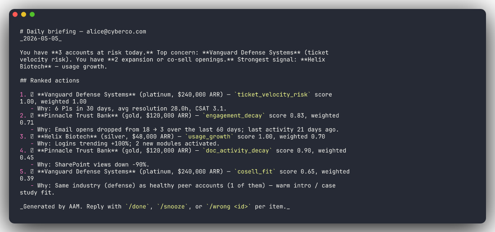
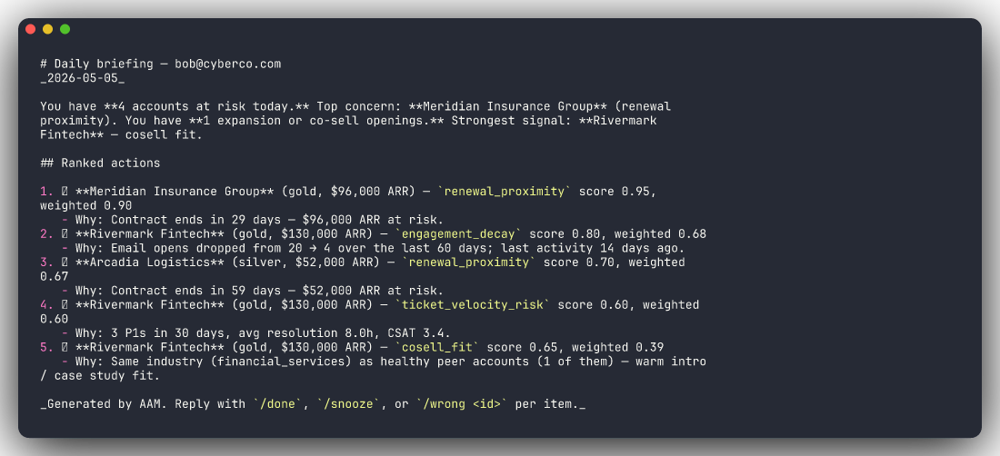
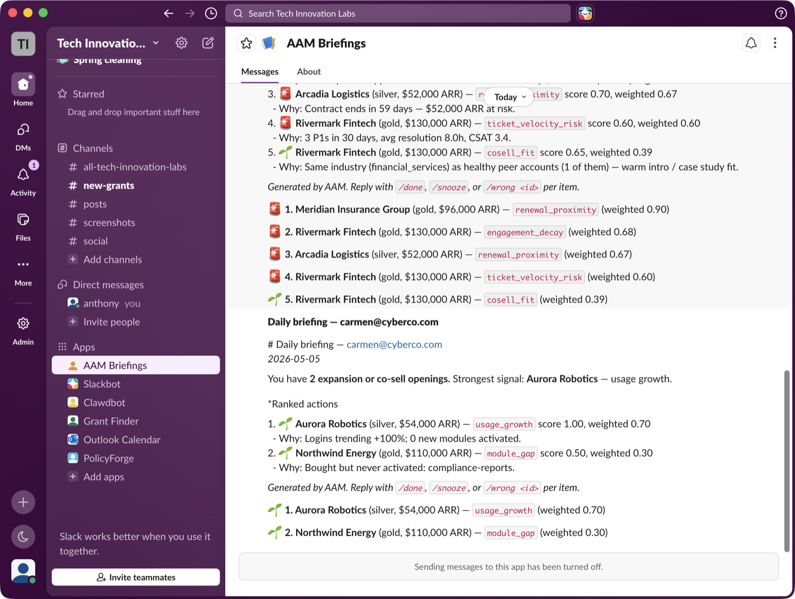

# ai-account-manager

Always-on AI revenue co-pilot for B2B account managers. Watches every active partner account across HubSpot, Zendesk, Microsoft 365, and the internal portal. Each morning, hands every human AM a ranked list: who to call, what to upsell, who's silently churning, who's ready for tier promotion, where co-sell openings exist.


### Same data, three different ranked lists — one per AM

Each AM's portfolio surfaces a different shape of attention. Alice's morning leads with a P1 incident risk on a $240K account and a silent-churn account no one had noticed; Bob's day is dominated by a 29-day renewal cliff and a combined-risk account.

<p>
  
  
</p>

### Delivered as Slack DMs (real workspace, real bot, real Block Kit)

The briefing graph's final node opens a DM with each AM and posts a Block Kit message — header, narrative summary, then one section per ranked action with a risk / opportunity emoji.



## Why this exists

Account managers shouldn't have to grep through 5 dashboards every morning to figure out which 12 of their 60 accounts deserve their attention today. AAM does that synthesis for them, deterministically — and explains *why* each account is on the list, citing the specific signals.

## What's in v0

| Capability | Status |
|---|---|
| 7 deterministic signal computers (engagement decay, ticket velocity, module gap, usage growth, renewal proximity, doc activity decay, co-sell fit) | ✓ |
| Weighted ranker, top-N per AM | ✓ |
| LangGraph briefing agent (rank → narrative → render → persist) | ✓ |
| Markdown + JSON output, briefing persistence | ✓ |
| FastAPI feedback endpoints (`done` / `snooze` / `wrong`) | ✓ |
| 12 synthetic accounts engineered to surface every briefing pattern | ✓ |
| LLM stub fallback (runs without ANTHROPIC_API_KEY) | ✓ |
| Optional Langfuse tracing | ✓ |
| Live snapshot pullers using `b2b-agent-toolkit` adapters | ✓ |
| Slack DM output | planned (separate channel — straightforward to add) |
| AM feedback → automatic weight tuning | planned |

## Architecture

```
                ┌── HubSpot ──┐
                ├── Zendesk ──┤              snapshot pullers
  cron / event ─┼── M365 ─────┼─── (toolkit) ───────────────────►  AccountSnapshot
                ├── Portal ───┤                                            │
                └─────────────┘                                            ▼
                                          deterministic signal computers (no LLM)
                                                                           │
                                                                           ▼
                                                                weighted ranker (per AM)
                                                                           │
                                                                           ▼
                                                       LangGraph briefing agent (LLM narrative)
                                                                           │
                                                          ┌────────────────┼─────────────┐
                                                          ▼                ▼             ▼
                                                     markdown / JSON   Slack (planned)  feedback API
                                                                                         │
                                                                                         ▼
                                                                                 re-tunes weights
```

## Quick start

```bash
# 1. Install (assumes b2b-agent-toolkit is at ../b2b-agent-toolkit)
cd ../b2b-agent-toolkit && pip install -e ".[dev]" && cd -
pip install -e ".[dev]"

cp .env.example .env
# leave ANTHROPIC_API_KEY blank for stub mode, or set it for real briefings

# 2. Seed the local SQLite DB with 12 synthetic accounts
aam seed

# 3. Compute signals from those snapshots
aam score

# 4. Generate today's briefing for one of the 3 sample AMs:
aam brief --am alice@cyberco.com
aam brief --am bob@cyberco.com
aam brief --am carmen@cyberco.com

# 5. Run the feedback API in another terminal
aam feedback-server
# POST /v1/feedback {briefing_id, account_id, am_email, verdict: done|snooze|wrong}
```

Briefings are saved to `briefings/<am>-<date>.md` and the run is persisted to SQLite so the same `briefing_id` can be referenced by feedback later.

## What the demo accounts show

The seed includes one account engineered to surface each briefing pattern, so a single `aam brief` run produces a recognizably real-looking ranked list:

| Account | Pattern |
|---|---|
| Pinnacle Trust Bank | Silently churning — engagement decay, no tickets (no obvious red flags) |
| Helix Biotech | Expansion-ready — usage and modules growing |
| Arcadia Logistics | Tier-promotion candidate — silver using all gold features |
| Vanguard Defense Systems | P1 incident risk — high P1 count, slow resolution, falling CSAT |
| Meridian Insurance Group | Renewal cliff — 45 days to contract end, no renewal conversation |
| Northwind Energy | Module gap — bought compliance, never activated |
| Sentinel Aerospace | Co-sell opening — defense industry fit with Vanguard |
| Rivermark Fintech | Combined risk — engagement decay + ticket spike |
| 4 others | Healthy / quiet / new — should NOT surface as priorities |

## Going to production

- Set `B2B_USE_MOCKS=false` and fill in real HubSpot / Zendesk / M365 / portal creds in the toolkit `.env`
- Swap `AAM_DATABASE_URL` to `postgresql+asyncpg://...`
- Wire `aam pull && aam score` into a nightly cron / APScheduler job
- Wire `aam brief --am <each_am>` into the morning send (M365 mailer or Slack)
- Stand up the feedback API behind your existing auth gateway
- Implement the weight-tuning loop (currently feedback is recorded but doesn't update weights yet)

## Layout

```
src/aam/
├── db.py            SQLAlchemy async models (Account, AccountSnapshot, Signal, Briefing, AmFeedback)
├── seed.py          12 synthetic accounts + snapshots
├── pullers.py       Live snapshot refresh via b2b-agent-toolkit adapters
├── signals.py       7 deterministic signal computers
├── scoring.py       Orchestrator: snapshots → signals → persist
├── ranker.py        Weighted ranking per AM
├── briefing.py      LangGraph: rank → narrative → render → persist
├── feedback.py      FastAPI feedback endpoints
├── tracing.py       Optional Langfuse
└── cli.py           Typer CLI: seed | pull | score | brief | feedback-server
```
